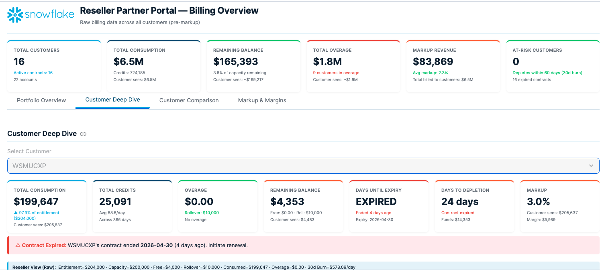
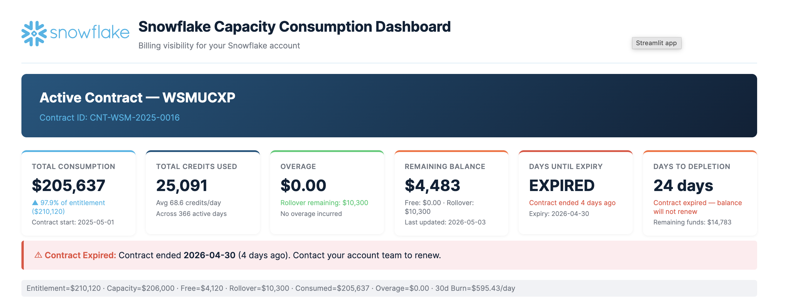
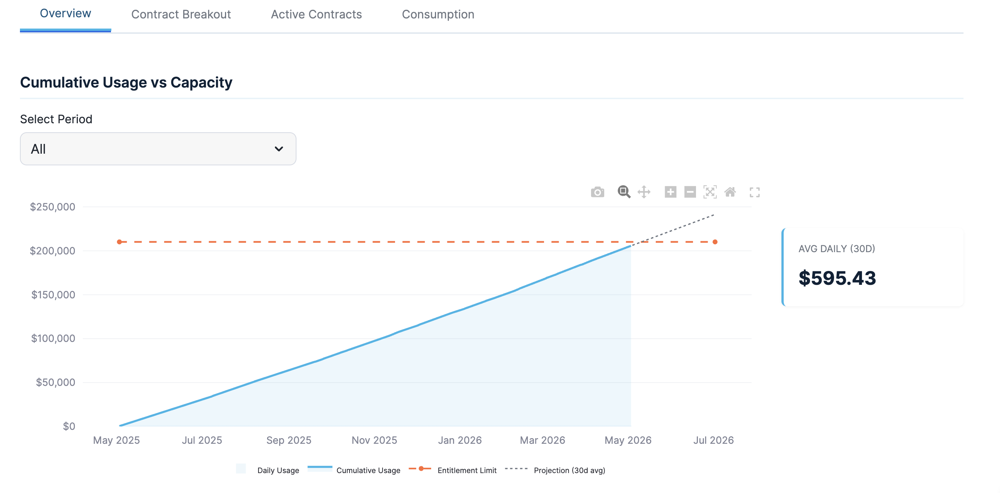
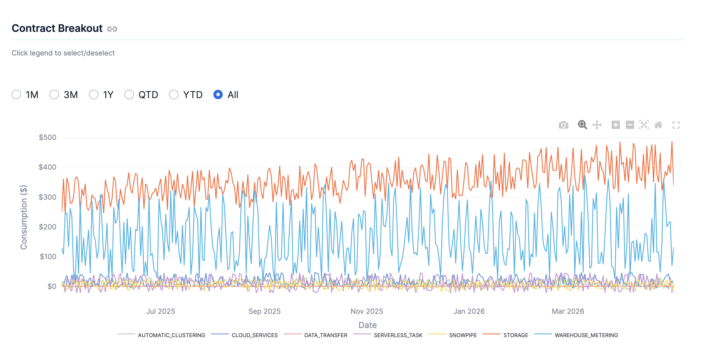
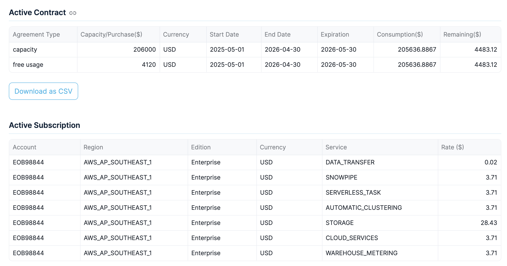
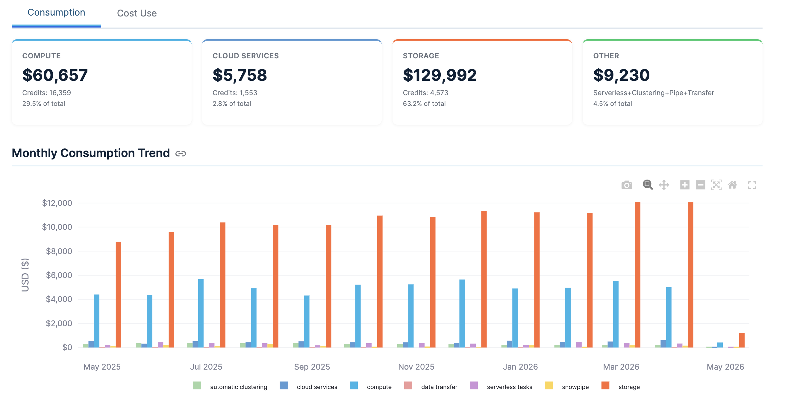

# Reseller Billing Data Sharing Solution

> **Disclaimer:** This solution is community-created and is **not an official Snowflake product**. It is not developed, maintained, or supported by Snowflake Inc. Use of this solution is at your own risk. Snowflake makes no warranties, express or implied, regarding its accuracy, reliability, or fitness for a particular purpose. Always review and test thoroughly in a non-production environment before deploying to production. For official guidance, refer to the [Snowflake Documentation](https://docs.snowflake.com).

## Table of Contents

1. [Background](#1-background)
2. [The Problem](#2-the-problem)
3. [Solution Overview](#3-solution-overview)
4. [Architecture](#4-architecture)
5. [Prerequisites](#5-prerequisites)
6. [Step-by-Step Setup Guide](#6-step-by-step-setup-guide)
7. [Day-to-Day Operations](#7-day-to-day-operations)
8. [Using This Demo vs. Production](#8-using-this-demo-vs-production)
9. [Streamlit Dashboards](#9-streamlit-dashboards)
10. [Frequently Asked Questions](#10-frequently-asked-questions)
11. [Troubleshooting](#11-troubleshooting)
12. [Reference: All Objects Created](#12-reference-all-objects-created)

---

## 1. Background

### What is the Snowflake BILLING Schema?

Snowflake provides a built-in schema called `SNOWFLAKE.BILLING` exclusively for **resellers and distributors**. This schema contains four views that give resellers full visibility into their customers' Snowflake usage, contracts, rates, and remaining balances:

| View | What It Shows | Latency |
|------|--------------|---------|
| `PARTNER_CONTRACT_ITEMS` | Contract details (capacity, free usage amounts, dates) | 24 hours |
| `PARTNER_RATE_SHEET_DAILY` | Effective rates per service type per day per account | 24 hours |
| `PARTNER_USAGE_IN_CURRENCY_DAILY` | Daily credit and dollar usage by account and service | 24 hours |
| `PARTNER_REMAINING_BALANCE_DAILY` | Daily remaining capacity, free usage, rollover, and on-demand balances | 24 hours |

These views are accessible only on the **reseller's organization account** using the **ACCOUNTADMIN** role.

### Who Is This For?

This solution is designed for **Snowflake reseller partners** in Southeast Asia (or any region) who need to:
- Share billing transparency with their end customers
- Maintain control over pricing by applying a markup
- Ensure strict data isolation between customers

---

## 2. The Problem

As a Snowflake reseller, you face three challenges:

### Challenge 1: Your Customers Cannot See Their Own Billing Data
Snowflake explicitly **blocks** end customers who signed through a reseller from accessing the `ORGANIZATION_USAGE` billing views (such as `USAGE_IN_CURRENCY_DAILY` or `REMAINING_BALANCE_DAILY`). This is by design to protect reseller margins. But your customers still need billing visibility.

### Challenge 2: Data Isolation Between Customers
The `SNOWFLAKE.BILLING` views contain data for **all** your customers in one place. You cannot share these views directly because Customer A would see Customer B's usage, contracts, and rates. Each customer must only see their own data.

### Challenge 3: Reseller Markup
Your contract with Snowflake has one rate. Your contract with each customer may have a different (higher) rate. The billing data you share with customers must reflect **the customer's rate**, not yours. Sharing the raw data would expose your margin.

---

## 3. Solution Overview

We solve all three problems using a combination of Snowflake features:

| Problem | Solution | Snowflake Feature Used |
|---------|----------|----------------------|
| Customers can't see billing | Share data to their accounts | Snowflake Secure Data Sharing |
| Data isolation | Filter rows by consumer account | Secure Views + `CURRENT_ACCOUNT()` |
| Markup pricing | Multiply dollar amounts before sharing | Configuration tables + Secure Views |

### How It Works (Simple Explanation)

1. Your billing data lives in `SNOWFLAKE.BILLING` (or in this demo, in `RESELLER_BILLING_FINAL.BILLING`)
2. We create **configuration tables** where you define:
   - Which customer maps to which Snowflake account
   - What markup percentage applies to each customer
3. We create **secure views** that:
   - Join the billing data with the configuration
   - Filter rows so each customer sees only their own data (using `CURRENT_ACCOUNT()`)
   - Multiply all dollar amounts by `(1 + markup_percentage)`
4. We create a **Snowflake Share** and grant access to the secure views
5. Customers create a database from the share and query their billing data

**No ETL, no data copies, no scheduling.** Customers always see the latest data automatically.

---

## 4. Architecture

```
┌──────────────────────────────────────────────────────────────────────┐
│                    RESELLER ACCOUNT (Provider)                       │
│                                                                      │
│  ┌─────────────────────────────────────────────────────────────┐     │
│  │  SNOWFLAKE.BILLING (Real Data Source)                       │     │
│  │  ┌─────────────────────┐  ┌──────────────────────────────┐  │     │
│  │  │ PARTNER_CONTRACT_   │  │ PARTNER_RATE_SHEET_DAILY     │  │     │
│  │  │ ITEMS               │  │                              │  │     │
│  │  └─────────────────────┘  └──────────────────────────────┘  │     │
│  │  ┌─────────────────────┐  ┌──────────────────────────────┐  │     │
│  │  │ PARTNER_USAGE_IN_   │  │ PARTNER_REMAINING_BALANCE_   │  │     │
│  │  │ CURRENCY_DAILY      │  │ DAILY                        │  │     │
│  │  └────────┬────────────┘  └──────────────┬───────────────┘  │     │
│  └───────────┼──────────────────────────────┼──────────────────┘     │
│              │ Raw data (never shared)       │                        │
│              ▼                               ▼                        │
│  ┌─────────────────────────────────────────────────────────────┐     │
│  │  SHARING_CONFIG (Private - Reseller Only)                   │     │
│  │                                                             │     │
│  │  ┌──────────────────┐    ┌──────────────────────────────┐   │     │
│  │  │ ACCOUNT_MAPPING  │    │ MARKUP_RATES                 │   │     │
│  │  │                  │    │                              │   │     │
│  │  │ Org → Account    │    │ Org → Markup %  (max 5%)    │   │     │
│  │  │ locator mapping  │    │ with effective date range    │   │     │
│  │  └────────┬─────────┘    └──────────────┬───────────────┘   │     │
│  └───────────┼─────────────────────────────┼───────────────────┘     │
│              │                              │                         │
│              ▼                              ▼                         │
│  ┌─────────────────────────────────────────────────────────────┐     │
│  │  SHARED Schema (Exposed via Share)                          │     │
│  │                                                             │     │
│  │  ┌───────────────────────────────────────────────────────┐  │     │
│  │  │              4 x SECURE VIEWS                         │  │     │
│  │  │                                                       │  │     │
│  │  │  Each view applies:                                   │  │     │
│  │  │  1. JOIN to ACCOUNT_MAPPING                           │  │     │
│  │  │     → WHERE CURRENT_ACCOUNT() = account_locator       │  │     │
│  │  │     → Row-level isolation per consumer                │  │     │
│  │  │                                                       │  │     │
│  │  │  2. JOIN to MARKUP_RATES                              │  │     │
│  │  │     → amount * (1 + markup_pct)                       │  │     │
│  │  │     → Customer sees marked-up prices only             │  │     │
│  │  └───────────────────────────────────────────────────────┘  │     │
│  └──────────────────────────┬──────────────────────────────────┘     │
│                             │                                        │
│  ┌──────────────────────────┴──────────────────────────────────┐     │
│  │  RESELLER_BILLING_SHARE                                     │     │
│  │  Grants: USAGE on DB + Schema, SELECT on 4 secure views    │     │
│  └──────────────────────────┬──────────────────────────────────┘     │
│                             │                                        │
└─────────────────────────────┼────────────────────────────────────────┘
                              │
            Snowflake Secure Data Sharing (zero-copy, real-time)
                              │
        ┌─────────────────────┼─────────────────────┐
        │                     │                     │
        ▼                     ▼                     ▼
┌──────────────┐   ┌──────────────┐   ┌──────────────────┐
│  Customer A  │   │  Customer B  │   │  Customer C      │
│  (e.g.       │   │  (e.g.       │   │  (e.g.           │
│  WSMUCXP)    │   │  Tokopedia)  │   │  Grab)           │
│              │   │              │   │                  │
│ Sees ONLY:   │   │ Sees ONLY:   │   │ Sees ONLY:       │
│ - Own usage  │   │ - Own usage  │   │ - Own usage      │
│ - Own rates  │   │ - Own rates  │   │ - Own rates      │
│ - 3% markup  │   │ - 2% markup  │   │ - 1.5% markup    │
│              │   │              │   │                  │
│ Cannot see   │   │ Cannot see   │   │ Cannot see       │
│ other custs  │   │ other custs  │   │ other custs      │
└──────────────┘   └──────────────┘   └──────────────────┘
```

### Data Flow Summary

```
SNOWFLAKE.BILLING (raw)
        │
        │  (in production, views read directly from here)
        │  (in this demo, we use RESELLER_BILLING_FINAL.BILLING with synthetic data)
        ▼
SECURE VIEWS apply:
   ├── Row Filter:    CURRENT_ACCOUNT() = customer's account locator
   ├── Markup:        dollar_amount × (1 + markup_pct)
   └── Date Scoping:  markup effective date range honored
        │
        ▼
SNOWFLAKE SHARE → Consumer Account
        │
        ▼
Consumer creates database from share → queries 4 views
```

### Security Model

```
                    ┌─────────────────────────┐
                    │    What Each Party       │
                    │       Can Access         │
                    └─────────────────────────┘

Reseller (ACCOUNTADMIN):
  ✅ Raw billing data (BILLING schema)
  ✅ Markup configuration (SHARING_CONFIG schema)
  ✅ Shared views (SHARED schema)
  ✅ Share management

Customer (Consumer Account):
  ✅ Their own billing data (marked up)
  ❌ Other customers' data
  ❌ Raw (pre-markup) amounts
  ❌ Markup percentages
  ❌ SHARING_CONFIG tables
  ❌ View definitions (secure views hide SQL)
```

---

## 5. Prerequisites

Before you begin, make sure you have:

| Requirement | Details |
|-------------|---------|
| **Snowflake Role** | ACCOUNTADMIN on the reseller's organization account |
| **BILLING Schema Access** | Your account must have ORGADMIN enabled and be a reseller/distributor to access `SNOWFLAKE.BILLING` |
| **Customer Account Locators** | The Snowflake account locator for each customer you want to share with (customers can find this under Admin > Accounts in Snowsight) |
| **Markup Agreement** | The agreed markup percentage for each customer (must be between 0% and 5%) |
| **Warehouse** | A warehouse to run the setup queries (any size is fine for setup) |

---

## 6. Step-by-Step Setup Guide

### Step 1: Create the Database and Schemas

> **Note for Production:** In production, your billing data already exists in `SNOWFLAKE.BILLING`. You only need to create the database for the sharing infrastructure (configuration tables and secure views). You do NOT need to create or copy the billing data.

Log into Snowsight as ACCOUNTADMIN and run:

```sql
-- Create a database for the sharing solution
CREATE DATABASE IF NOT EXISTS RESELLER_BILLING_FINAL;

-- Schema for configuration tables (private to reseller)
CREATE SCHEMA IF NOT EXISTS RESELLER_BILLING_FINAL.SHARING_CONFIG;

-- Schema for secure views (will be shared to customers)
CREATE SCHEMA IF NOT EXISTS RESELLER_BILLING_FINAL.SHARED;
```

### Step 2: Create the Account Mapping Table

This table tells the system which customer organization maps to which Snowflake account. This is how row-level filtering works.

```sql
CREATE OR REPLACE TABLE RESELLER_BILLING_FINAL.SHARING_CONFIG.ACCOUNT_MAPPING (
    SOLD_TO_ORGANIZATION_NAME VARCHAR NOT NULL,
    SOLD_TO_CUSTOMER_NAME VARCHAR NOT NULL,
    CONSUMER_ACCOUNT_LOCATOR VARCHAR NOT NULL,
    IS_ACTIVE BOOLEAN DEFAULT TRUE,
    CREATED_AT TIMESTAMP_NTZ DEFAULT CURRENT_TIMESTAMP(),
    UPDATED_AT TIMESTAMP_NTZ DEFAULT CURRENT_TIMESTAMP(),
    CONSTRAINT UQ_ORG_ACCOUNT UNIQUE (SOLD_TO_ORGANIZATION_NAME, CONSUMER_ACCOUNT_LOCATOR)
);
```

**Column explanations:**

| Column | What To Put Here |
|--------|-----------------|
| `SOLD_TO_ORGANIZATION_NAME` | The organization name as it appears in `SNOWFLAKE.BILLING` views. You can find this by querying `SELECT DISTINCT SOLD_TO_ORGANIZATION_NAME FROM SNOWFLAKE.BILLING.PARTNER_CONTRACT_ITEMS` |
| `SOLD_TO_CUSTOMER_NAME` | The customer's display name (also from the billing views) |
| `CONSUMER_ACCOUNT_LOCATOR` | The customer's Snowflake account locator. Ask your customer to check **Admin > Accounts** in Snowsight, or check it in your organization account |
| `IS_ACTIVE` | Set to `TRUE` to enable sharing, `FALSE` to disable without deleting the record |

**Insert your customer mappings:**

```sql
-- Replace with your real customer data
INSERT INTO RESELLER_BILLING_FINAL.SHARING_CONFIG.ACCOUNT_MAPPING
    (SOLD_TO_ORGANIZATION_NAME, SOLD_TO_CUSTOMER_NAME, CONSUMER_ACCOUNT_LOCATOR)
VALUES
    ('CUSTOMER_ORG_1', 'Customer Company Name 1', 'ABC12345'),
    ('CUSTOMER_ORG_2', 'Customer Company Name 2', 'DEF67890');
```

**How to find the right values:**

```sql
-- Run this on your reseller account to see all customer organizations
SELECT DISTINCT
    SOLD_TO_ORGANIZATION_NAME,
    SOLD_TO_CUSTOMER_NAME
FROM SNOWFLAKE.BILLING.PARTNER_CONTRACT_ITEMS
ORDER BY SOLD_TO_CUSTOMER_NAME;
```

### Step 3: Create the Markup Rates Table

This table controls what markup percentage is applied to each customer's billing data.

```sql
CREATE OR REPLACE TABLE RESELLER_BILLING_FINAL.SHARING_CONFIG.MARKUP_RATES (
    SOLD_TO_ORGANIZATION_NAME VARCHAR NOT NULL,
    MARKUP_PCT NUMBER(5,4) NOT NULL DEFAULT 0.0000,
    EFFECTIVE_FROM DATE NOT NULL DEFAULT CURRENT_DATE(),
    EFFECTIVE_TO DATE DEFAULT NULL,
    IS_ACTIVE BOOLEAN DEFAULT TRUE,
    CREATED_AT TIMESTAMP_NTZ DEFAULT CURRENT_TIMESTAMP(),
    UPDATED_AT TIMESTAMP_NTZ DEFAULT CURRENT_TIMESTAMP(),
    CONSTRAINT CHK_MARKUP_MAX CHECK (MARKUP_PCT >= 0 AND MARKUP_PCT <= 0.05)
);
```

**Important notes about this table:**

- `MARKUP_PCT` is a decimal: `0.03` means 3%, `0.05` means 5%
- The `CHECK` constraint **enforces a maximum of 5%** — any INSERT with a value above 0.05 will fail
- `EFFECTIVE_FROM` / `EFFECTIVE_TO` allow you to change markups over time while preserving history
- Set `EFFECTIVE_TO` to `NULL` for the current (latest) markup rate

**Insert markup rates for your customers:**

```sql
INSERT INTO RESELLER_BILLING_FINAL.SHARING_CONFIG.MARKUP_RATES
    (SOLD_TO_ORGANIZATION_NAME, MARKUP_PCT, EFFECTIVE_FROM)
VALUES
    ('CUSTOMER_ORG_1', 0.0300, '2025-05-01'),   -- 3.0% markup
    ('CUSTOMER_ORG_2', 0.0000, '2025-05-01');    -- 0.0% no markup (pass-through)
```

### Step 4: Create the Secure Views

These views are the core of the solution. Each view:
1. Reads from the billing source tables
2. Joins to `ACCOUNT_MAPPING` to filter rows (only the querying customer's data)
3. Joins to `MARKUP_RATES` to apply the correct markup to dollar amounts

> **For Production:** Replace `RESELLER_BILLING_FINAL.BILLING.` with `SNOWFLAKE.BILLING.` in the FROM clauses below. That's the only change needed.

**View 1: Contract Items**

```sql
CREATE OR REPLACE SECURE VIEW RESELLER_BILLING_FINAL.SHARED.PARTNER_CONTRACT_ITEMS AS
SELECT
    c.ORGANIZATION_NAME,
    c.SOLD_TO_ORGANIZATION_NAME,
    c.SOLD_TO_CUSTOMER_NAME,
    c.SOLD_TO_PO_NUMBER,
    c.SOLD_TO_CONTRACT_NUMBER,
    c.START_DATE,
    c.END_DATE,
    c.EXPIRATION_DATE,
    c.CONTRACT_ITEM,
    c.CURRENCY,
    ROUND(c.AMOUNT * (1 + COALESCE(m.MARKUP_PCT, 0)), 4) AS AMOUNT,
    c.CONTRACT_MODIFIED_DATE
FROM RESELLER_BILLING_FINAL.BILLING.PARTNER_CONTRACT_ITEMS c
JOIN RESELLER_BILLING_FINAL.SHARING_CONFIG.ACCOUNT_MAPPING a
    ON c.SOLD_TO_ORGANIZATION_NAME = a.SOLD_TO_ORGANIZATION_NAME
    AND a.IS_ACTIVE = TRUE
    AND a.CONSUMER_ACCOUNT_LOCATOR = CURRENT_ACCOUNT()
LEFT JOIN RESELLER_BILLING_FINAL.SHARING_CONFIG.MARKUP_RATES m
    ON c.SOLD_TO_ORGANIZATION_NAME = m.SOLD_TO_ORGANIZATION_NAME
    AND m.IS_ACTIVE = TRUE
    AND CURRENT_DATE() >= m.EFFECTIVE_FROM
    AND (m.EFFECTIVE_TO IS NULL OR CURRENT_DATE() <= m.EFFECTIVE_TO);
```

**View 2: Rate Sheet Daily**

```sql
CREATE OR REPLACE SECURE VIEW RESELLER_BILLING_FINAL.SHARED.PARTNER_RATE_SHEET_DAILY AS
SELECT
    r.ORGANIZATION_NAME,
    r.SOLD_TO_ORGANIZATION_NAME,
    r.SOLD_TO_CUSTOMER_NAME,
    r.SOLD_TO_PO_NUMBER,
    r.SOLD_TO_CONTRACT_NUMBER,
    r.DATE,
    r.ACCOUNT_NAME,
    r.ACCOUNT_LOCATOR,
    r.REGION,
    r.SERVICE_LEVEL,
    r.USAGE_TYPE,
    r.BILLING_TYPE,
    r.RATING_TYPE,
    r.SERVICE_TYPE,
    r.IS_ADJUSTMENT,
    r.CURRENCY,
    ROUND(r.EFFECTIVE_RATE * (1 + COALESCE(m.MARKUP_PCT, 0)), 2) AS EFFECTIVE_RATE
FROM RESELLER_BILLING_FINAL.BILLING.PARTNER_RATE_SHEET_DAILY r
JOIN RESELLER_BILLING_FINAL.SHARING_CONFIG.ACCOUNT_MAPPING a
    ON r.SOLD_TO_ORGANIZATION_NAME = a.SOLD_TO_ORGANIZATION_NAME
    AND a.IS_ACTIVE = TRUE
    AND a.CONSUMER_ACCOUNT_LOCATOR = CURRENT_ACCOUNT()
LEFT JOIN RESELLER_BILLING_FINAL.SHARING_CONFIG.MARKUP_RATES m
    ON r.SOLD_TO_ORGANIZATION_NAME = m.SOLD_TO_ORGANIZATION_NAME
    AND m.IS_ACTIVE = TRUE
    AND r.DATE >= m.EFFECTIVE_FROM
    AND (m.EFFECTIVE_TO IS NULL OR r.DATE <= m.EFFECTIVE_TO);
```

**View 3: Usage in Currency Daily**

```sql
CREATE OR REPLACE SECURE VIEW RESELLER_BILLING_FINAL.SHARED.PARTNER_USAGE_IN_CURRENCY_DAILY AS
SELECT
    u.ORGANIZATION_NAME,
    u.SOLD_TO_ORGANIZATION_NAME,
    u.SOLD_TO_CUSTOMER_NAME,
    u.SOLD_TO_PO_NUMBER,
    u.SOLD_TO_CONTRACT_NUMBER,
    u.ACCOUNT_NAME,
    u.ACCOUNT_LOCATOR,
    u.REGION,
    u.SERVICE_LEVEL,
    u.USAGE_DATE,
    u.USAGE_TYPE,
    u.CURRENCY,
    u.USAGE,
    ROUND(u.USAGE_IN_CURRENCY * (1 + COALESCE(m.MARKUP_PCT, 0)), 6) AS USAGE_IN_CURRENCY,
    u.BALANCE_SOURCE,
    u.BILLING_TYPE,
    u.RATING_TYPE,
    u.SERVICE_TYPE,
    u.IS_ADJUSTMENT
FROM RESELLER_BILLING_FINAL.BILLING.PARTNER_USAGE_IN_CURRENCY_DAILY u
JOIN RESELLER_BILLING_FINAL.SHARING_CONFIG.ACCOUNT_MAPPING a
    ON u.SOLD_TO_ORGANIZATION_NAME = a.SOLD_TO_ORGANIZATION_NAME
    AND a.IS_ACTIVE = TRUE
    AND a.CONSUMER_ACCOUNT_LOCATOR = CURRENT_ACCOUNT()
LEFT JOIN RESELLER_BILLING_FINAL.SHARING_CONFIG.MARKUP_RATES m
    ON u.SOLD_TO_ORGANIZATION_NAME = m.SOLD_TO_ORGANIZATION_NAME
    AND m.IS_ACTIVE = TRUE
    AND u.USAGE_DATE >= m.EFFECTIVE_FROM
    AND (m.EFFECTIVE_TO IS NULL OR u.USAGE_DATE <= m.EFFECTIVE_TO);
```

**View 4: Remaining Balance Daily**

```sql
CREATE OR REPLACE SECURE VIEW RESELLER_BILLING_FINAL.SHARED.PARTNER_REMAINING_BALANCE_DAILY AS
SELECT
    b.ORGANIZATION_NAME,
    b.SOLD_TO_ORGANIZATION_NAME,
    b.SOLD_TO_CUSTOMER_NAME,
    b.SOLD_TO_PO_NUMBER,
    b.SOLD_TO_CONTRACT_NUMBER,
    b.DATE,
    b.CURRENCY,
    ROUND(b.FREE_USAGE_BALANCE * (1 + COALESCE(m.MARKUP_PCT, 0)), 2) AS FREE_USAGE_BALANCE,
    ROUND(b.CAPACITY_BALANCE * (1 + COALESCE(m.MARKUP_PCT, 0)), 2) AS CAPACITY_BALANCE,
    ROUND(b.ON_DEMAND_CONSUMPTION_BALANCE * (1 + COALESCE(m.MARKUP_PCT, 0)), 2) AS ON_DEMAND_CONSUMPTION_BALANCE,
    ROUND(b.ROLLOVER_BALANCE * (1 + COALESCE(m.MARKUP_PCT, 0)), 2) AS ROLLOVER_BALANCE,
    ROUND(b.MARKETPLACE_CAPACITY_DRAWDOWN_BALANCE * (1 + COALESCE(m.MARKUP_PCT, 0)), 2) AS MARKETPLACE_CAPACITY_DRAWDOWN_BALANCE
FROM RESELLER_BILLING_FINAL.BILLING.PARTNER_REMAINING_BALANCE_DAILY b
JOIN RESELLER_BILLING_FINAL.SHARING_CONFIG.ACCOUNT_MAPPING a
    ON b.SOLD_TO_ORGANIZATION_NAME = a.SOLD_TO_ORGANIZATION_NAME
    AND a.IS_ACTIVE = TRUE
    AND a.CONSUMER_ACCOUNT_LOCATOR = CURRENT_ACCOUNT()
LEFT JOIN RESELLER_BILLING_FINAL.SHARING_CONFIG.MARKUP_RATES m
    ON b.SOLD_TO_ORGANIZATION_NAME = m.SOLD_TO_ORGANIZATION_NAME
    AND m.IS_ACTIVE = TRUE
    AND b.DATE >= m.EFFECTIVE_FROM
    AND (m.EFFECTIVE_TO IS NULL OR b.DATE <= m.EFFECTIVE_TO);
```

### Step 5: Create the Share and Grant Privileges

```sql
USE ROLE ACCOUNTADMIN;

-- Create the share
CREATE OR REPLACE SHARE RESELLER_BILLING_SHARE
    COMMENT = 'Reseller billing data share - per-customer secure views with markup';

-- Grant access to the database, schema, and views
GRANT USAGE ON DATABASE RESELLER_BILLING_FINAL TO SHARE RESELLER_BILLING_SHARE;
GRANT USAGE ON SCHEMA RESELLER_BILLING_FINAL.SHARED TO SHARE RESELLER_BILLING_SHARE;
GRANT SELECT ON VIEW RESELLER_BILLING_FINAL.SHARED.PARTNER_CONTRACT_ITEMS TO SHARE RESELLER_BILLING_SHARE;
GRANT SELECT ON VIEW RESELLER_BILLING_FINAL.SHARED.PARTNER_RATE_SHEET_DAILY TO SHARE RESELLER_BILLING_SHARE;
GRANT SELECT ON VIEW RESELLER_BILLING_FINAL.SHARED.PARTNER_USAGE_IN_CURRENCY_DAILY TO SHARE RESELLER_BILLING_SHARE;
GRANT SELECT ON VIEW RESELLER_BILLING_FINAL.SHARED.PARTNER_REMAINING_BALANCE_DAILY TO SHARE RESELLER_BILLING_SHARE;
```

### Step 6: Add Consumer Accounts to the Share

For each customer you want to share with:

```sql
-- Format: ALTER SHARE <share_name> ADD ACCOUNTS = <org_name>.<account_name>;
-- Example: ALTER SHARE RESELLER_BILLING_SHARE ADD ACCOUNTS = CUSTOMER_ORG.ACCTNAME123;
ALTER SHARE RESELLER_BILLING_SHARE ADD ACCOUNTS = <CUSTOMER_ORG>.<CUSTOMER_ACCOUNT_NAME>;
```

You can add multiple accounts at once:

```sql
-- Example with multiple accounts:
ALTER SHARE RESELLER_BILLING_SHARE ADD ACCOUNTS = <ORG1>.<ACCOUNT1>, <ORG2>.<ACCOUNT2>;
```

### Step 7: Validate Before Notifying Customers

**Always test** before telling customers the share is ready. Use Snowflake's simulated consumer feature:

```sql
-- Simulate being a specific customer (use their account locator)
-- Find the locator in SHARING_CONFIG.ACCOUNT_MAPPING or ask the customer
ALTER SESSION SET SIMULATED_DATA_SHARING_CONSUMER = '<CUSTOMER_ACCOUNT_LOCATOR>';
-- Example: ALTER SESSION SET SIMULATED_DATA_SHARING_CONSUMER = 'ABC12345';

-- Test 1: Should only see WSMUCXP data
SELECT SOLD_TO_ORGANIZATION_NAME, CONTRACT_ITEM, AMOUNT
FROM RESELLER_BILLING_FINAL.SHARED.PARTNER_CONTRACT_ITEMS;

-- Test 2: Verify markup is applied (compare with raw)
SELECT ROUND(SUM(USAGE_IN_CURRENCY), 2) AS marked_up_total
FROM RESELLER_BILLING_FINAL.SHARED.PARTNER_USAGE_IN_CURRENCY_DAILY;

-- Test 3: Should return 0 rows for another customer's account
ALTER SESSION SET SIMULATED_DATA_SHARING_CONSUMER = 'TKP01234';
SELECT COUNT(*) FROM RESELLER_BILLING_FINAL.SHARED.PARTNER_CONTRACT_ITEMS
WHERE SOLD_TO_ORGANIZATION_NAME = 'WSMUCXP';
-- Expected: 0

-- Reset when done
ALTER SESSION UNSET SIMULATED_DATA_SHARING_CONSUMER;
```

### Step 8: Customer-Side Setup

Send the customer two files from the `customer_app/` folder:

| File | Purpose |
|------|---------|
| `customer_app/customer_setup.sql` | SQL script to accept the share and verify data access |
| `customer_app/streamlit_app.py` | Billing dashboard (optional — for visual analytics) |

> **Important:** Before sending `customer_setup.sql` to customers, update the share identifier on line 23 of that file with your actual reseller org and account name:
> ```sql
> -- Replace with your actual values (run SELECT CURRENT_ORGANIZATION_NAME(), CURRENT_ACCOUNT(); to find them)
> CREATE DATABASE IF NOT EXISTS RESELLER_BILLING
>     FROM SHARE <YOUR_ORG>.<YOUR_ACCOUNT>.RESELLER_BILLING_SHARE;
> -- Example: FROM SHARE MYORG.MYACCOUNT.RESELLER_BILLING_SHARE
> ```

**Instructions to send to the customer:**

```
Dear Customer,

We have set up a Snowflake Data Share to provide you with billing
visibility. Please follow these steps:

1. Download the attached customer_setup.sql file
2. Log into Snowsight as ACCOUNTADMIN
3. Open a SQL Worksheet and run customer_setup.sql
   - This creates a RESELLER_BILLING database from our share
   - Grants access to SYSADMIN (you can change the role in the script)
   - Runs a verification query to confirm data access

4. (Optional) Set up the billing dashboard:
   - Go to Streamlit > + Streamlit App
   - Paste the content of the attached streamlit_app.py
   - In the packages panel, add: plotly
   - Run the app

Data refreshes automatically with up to 24-hour latency.
No action is required on your part to keep data current.
```

---

## 7. Day-to-Day Operations

### Onboarding a New Customer

When a new customer signs a contract, you need to do three things: register the mapping, set the markup, and add them to the share.

```sql
-- ============================================
-- EXAMPLE: Onboarding "PT Tiket Com"
-- Account locator: TKT99999
-- Agreed markup: 2.5%
-- ============================================

-- Step A: Register the account mapping
INSERT INTO RESELLER_BILLING_FINAL.SHARING_CONFIG.ACCOUNT_MAPPING
    (SOLD_TO_ORGANIZATION_NAME, SOLD_TO_CUSTOMER_NAME, CONSUMER_ACCOUNT_LOCATOR)
VALUES
    ('TIKET_COM_ORG', 'PT Tiket Com', 'TKT99999');

-- Step B: Set the markup rate
INSERT INTO RESELLER_BILLING_FINAL.SHARING_CONFIG.MARKUP_RATES
    (SOLD_TO_ORGANIZATION_NAME, MARKUP_PCT, EFFECTIVE_FROM)
VALUES
    ('TIKET_COM_ORG', 0.0250, CURRENT_DATE());

-- Step C: Add to share (requires ACCOUNTADMIN)
USE ROLE ACCOUNTADMIN;
ALTER SHARE RESELLER_BILLING_SHARE ADD ACCOUNTS = TIKET_COM_ORG.TKT99999;

-- Step D: Validate
ALTER SESSION SET SIMULATED_DATA_SHARING_CONSUMER = 'TKT99999';
SELECT * FROM RESELLER_BILLING_FINAL.SHARED.PARTNER_CONTRACT_ITEMS;
ALTER SESSION UNSET SIMULATED_DATA_SHARING_CONSUMER;
```

No view changes needed. The secure views automatically pick up the new customer.

### Changing a Customer's Markup

To change markup while preserving historical data:

```sql
-- ============================================
-- EXAMPLE: Change WSMUCXP from 3% to 4%
-- Effective July 1, 2025
-- ============================================

-- Step A: Expire the current rate
UPDATE RESELLER_BILLING_FINAL.SHARING_CONFIG.MARKUP_RATES
   SET EFFECTIVE_TO = '2025-06-30',
       UPDATED_AT = CURRENT_TIMESTAMP()
WHERE SOLD_TO_ORGANIZATION_NAME = 'WSMUCXP'
  AND IS_ACTIVE = TRUE
  AND EFFECTIVE_TO IS NULL;

-- Step B: Insert the new rate
INSERT INTO RESELLER_BILLING_FINAL.SHARING_CONFIG.MARKUP_RATES
    (SOLD_TO_ORGANIZATION_NAME, MARKUP_PCT, EFFECTIVE_FROM)
VALUES
    ('WSMUCXP', 0.0400, '2025-07-01');
```

The secure views handle the date-based lookup automatically. Data before July 1 shows the 3% markup, data from July 1 onward shows 4%.

### Deactivating a Customer

When a customer's contract ends:

```sql
-- ============================================
-- EXAMPLE: Deactivate Bukalapak
-- ============================================

-- Step A: Disable in mapping (views immediately stop returning data)
UPDATE RESELLER_BILLING_FINAL.SHARING_CONFIG.ACCOUNT_MAPPING
   SET IS_ACTIVE = FALSE,
       UPDATED_AT = CURRENT_TIMESTAMP()
WHERE SOLD_TO_ORGANIZATION_NAME = 'BUKALAPAK_ORG';

-- Step B: Remove from share
USE ROLE ACCOUNTADMIN;
ALTER SHARE RESELLER_BILLING_SHARE REMOVE ACCOUNTS = BUKALAPAK_ORG.BKL05678;
```

### Checking Current Markup Configuration

```sql
-- View all active markups
SELECT
    m.SOLD_TO_ORGANIZATION_NAME,
    a.SOLD_TO_CUSTOMER_NAME,
    m.MARKUP_PCT * 100 AS MARKUP_PERCENT,
    m.EFFECTIVE_FROM,
    m.EFFECTIVE_TO
FROM RESELLER_BILLING_FINAL.SHARING_CONFIG.MARKUP_RATES m
JOIN RESELLER_BILLING_FINAL.SHARING_CONFIG.ACCOUNT_MAPPING a
    ON m.SOLD_TO_ORGANIZATION_NAME = a.SOLD_TO_ORGANIZATION_NAME
WHERE m.IS_ACTIVE = TRUE
  AND (m.EFFECTIVE_TO IS NULL OR m.EFFECTIVE_TO >= CURRENT_DATE())
ORDER BY m.MARKUP_PCT DESC;
```

---

## 8. Using This Demo vs. Production

This repository includes demo files with synthetic data for testing. Here is the key difference when moving to production:

### Demo (This Repository)

| Component | Demo | Description |
|-----------|------|-------------|
| **Source Data** | `RESELLER_BILLING_FINAL.BILLING.*` | Synthetic data generated by `reseller_billing_synthetic_data.sql` |
| **Customers** | 16 synthetic SE Asia companies | Tokopedia, Gojek, Grab, WSMUCXP, etc. |
| **Account Locators** | Fake locators | TKP01234, WSMXXX0001, etc. |

### Production

| Component | Production | What To Change |
|-----------|-----------|----------------|
| **Source Data** | `SNOWFLAKE.BILLING.*` | Change the FROM clause in all 4 secure views |
| **Customers** | Your real customers | Use real org names from `SNOWFLAKE.BILLING.PARTNER_CONTRACT_ITEMS` |
| **Account Locators** | Real locators | Get from customer or Admin > Accounts |

### What To Change for Production

The **only code change** required is in the 4 secure view definitions. Replace:

```
FROM RESELLER_BILLING_FINAL.BILLING.<view_name>
```

With:

```
FROM SNOWFLAKE.BILLING.<view_name>
```

Everything else (SHARING_CONFIG tables, SHARE object, SHARED schema) stays exactly the same.

### Files in This Repository

| File / Folder | Purpose | Needed for Production? |
|------|---------|----------------------|
| `reseller_billing_synthetic_data.sql` | Generates fake billing data for demo/testing | **No** — in production, data comes from `SNOWFLAKE.BILLING` |
| `reseller_billing_sharing_setup.sql` | Creates sharing infrastructure (config tables, secure views, share) | **Yes** — this is the production setup script (change FROM clause as noted above) |
| `reseller_app/streamlit_app.py` | Reseller portal dashboard (all customers, raw data, margins) | **Yes** — run on the reseller account |
| `reseller_app/environment.yml` | Dependencies for reseller dashboard | **Yes** |
| `customer_app/streamlit_app.py` | Customer billing dashboard (single customer, marked-up data) | **Yes** — customer copies to their account |
| `customer_app/customer_setup.sql` | SQL script for customer to accept share and verify data | **Yes** — send to customer |
| `customer_app/environment.yml` | Dependencies for customer dashboard | **Yes** |
| `screenshot/` | Dashboard screenshots for documentation | No |
| `README.md` | This documentation | Reference only |

---

## 9. Streamlit Dashboards

This solution includes two Streamlit dashboards — one for the reseller and one for the customer. They are designed as a pair: the reseller sees raw data across all customers, while each customer sees only their own marked-up data.

### 9.0 Dashboard Screenshots

**Reseller Partner Portal:**



**Customer Billing Dashboard:**











### 9.1 Workspace Structure

```
├── reseller_app/
│   ├── streamlit_app.py          ← Reseller Partner Portal
│   └── environment.yml
├── customer_app/
│   ├── streamlit_app.py          ← Customer Billing Dashboard
│   └── environment.yml
```

### 9.2 Reseller App — Setup

The reseller app runs on the **reseller's own Snowflake account**. It reads from the raw billing tables (`RESELLER_BILLING_FINAL.BILLING.*`) and the configuration tables (`SHARING_CONFIG.*`).

**How to deploy:**

1. Open Snowsight on the reseller account
2. Go to **Streamlit** > **+ Streamlit App**
3. Copy the content of `reseller_app/streamlit_app.py` into the app editor
4. In the packages panel, install `plotly`
5. Make sure the app runs with a role that has SELECT on:
   - `RESELLER_BILLING_FINAL.BILLING.*` (all 4 tables)
   - `RESELLER_BILLING_FINAL.SHARING_CONFIG.MARKUP_RATES`
   - `RESELLER_BILLING_FINAL.SHARING_CONFIG.ACCOUNT_MAPPING`
6. Run the app

**Data source:** `RESELLER_BILLING_FINAL.BILLING.*` (raw, pre-markup data)

### 9.3 Reseller App — Dashboard Guide

The reseller app has 4 tabs:

#### Tab 1: Portfolio Overview

**Top-level KPI cards (6 cards):**

| KPI | What It Shows | How to Interpret |
|-----|--------------|-----------------|
| **Total Customers** | Count of distinct customers with billing data | Includes all customers regardless of contract status. Shows account count and active contracts underneath. |
| **Total Consumption** | Sum of all customers' raw usage in dollars | This is your cost (what Snowflake charges you). The "Customer sees" line shows the total billed amount after markup. |
| **Remaining Balance** | Sum of remaining capacity across all contracts | "Customer sees" shows the marked-up balance. Percentage shows how much of total capacity is left. |
| **Total Overage** | Sum of on-demand charges across all customers | If > $0, some customers have exceeded their capacity and are on on-demand pricing. "Customer sees" shows the marked-up overage. |
| **Markup Revenue** | Total margin earned from markups | Calculated as: sum of (each customer's consumption × their markup %). "Total billed" = raw consumption + markup revenue. |
| **At-Risk Customers** | Count of customers whose capacity will deplete within 60 days | Based on the last 30-day average burn rate. Also shows count of expired contracts. Uses total funds (capacity + rollover + free). |

**Portfolio Chart:** Monthly stacked bar chart showing consumption by customer over time. Useful for identifying growth trends and dominant customers.

**Customer Summary Table:** One row per customer with Capacity, Consumed, Remaining, Overage, Burn Rate, Days to Depletion, Markup %, and Status (Active/At Risk/Expired). Downloadable as CSV.

#### Tab 2: Customer Deep Dive

Select a customer from the dropdown to see their detailed billing breakdown.

**KPI cards (7 cards):** Same 6 KPIs as the customer app, plus a Markup card:

| KPI | What It Shows | How to Interpret |
|-----|--------------|-----------------|
| **Total Consumption** | Customer's total raw spend | "Customer sees" shows marked-up total. The delta line shows % of entitlement used (capacity + free). |
| **Total Credits** | Credit count consumed | Raw credit units, not dollars. Shows average credits/day. |
| **Overage** | On-demand charges | $0 if customer hasn't exceeded capacity+rollover+free. If consumption > entitlement and capacity = 0, computed as consumption − entitlement. |
| **Remaining Balance** | Capacity balance remaining | "Customer sees" shows marked-up amount. Subtitle breaks down Free and Rollover balances. |
| **Days Until Expiry** | Days until contract end date | Shows EXPIRED (red) if past end date, with days since expiry. Warning at <30 and <60 days. |
| **Days to Depletion** | Estimated days until all funds (capacity + rollover + free) run out | Based on 30-day average daily burn rate. Shows DEPLETED if already exhausted. Remaining funds shown underneath. |
| **Markup** | Customer's markup percentage | Shows margin revenue in dollars and what the customer sees as their total. |

**Summary Bars (two rows):**
- **Reseller View (Raw):** Blue bar showing Entitlement, Capacity, Free, Rollover, Consumed, Overage, and 30d Burn at raw cost
- **Customer View (X% markup):** Yellow/orange bar showing the same metrics multiplied by (1 + markup%) — exactly what the customer sees in their own dashboard

**Alert Banners:**
- **Red — Capacity Depleted:** Shown when capacity balance = $0. Includes consumption total, rollover status, and action to contact customer.
- **Orange — Top-Up Advisory:** Shown when depletion date is before contract expiry. Includes burn rate, depletion date, and days before contract ends.
- **Red — Contract Expired:** Shown when current date is past contract end date. Includes days since expiry.

**Charts:** Cumulative usage vs entitlement limit chart, and usage by service type line chart.

#### Tab 3: Customer Comparison

Compare customers side-by-side on three metrics:
- **Total Consumption ($):** Who spends the most
- **Total Credits:** Who uses the most compute
- **30d Burn Rate ($/day):** Who is consuming fastest right now

Horizontal bar chart for ranking, plus a monthly trend line chart for the top 5 customers.

#### Tab 4: Markup & Margins

Complete margin analysis:
- **Total Margin Revenue KPI:** Aggregate margin across all customers
- **Average Markup KPI:** Range from min to max, count of 0% customers
- **Margin Table:** Per-customer breakdown showing Raw Spend, Margin Revenue, Customer Sees, Account Locator, and Active status. Downloadable as CSV.
- **Margin Revenue Chart:** Horizontal bar ranking customers by margin contribution

### 9.4 Customer App — Setup

The customer app runs on the **customer's Snowflake account**. It reads from the shared database created from the reseller's share. The customer only sees their own data, already marked up.

**How to deploy (customer does this):**

1. Run `customer_app/customer_setup.sql` in Snowsight as ACCOUNTADMIN:
   - This creates the `RESELLER_BILLING` database from the share
   - Grants access to SYSADMIN
   - Runs verification queries
2. Open Snowsight on the customer account
3. Go to **Streamlit** > **+ Streamlit App**
4. Copy the content of `customer_app/streamlit_app.py` into the app editor
5. In the packages panel, install `plotly`
6. Run the app

**Data source:** `RESELLER_BILLING.SHARED.*` (marked-up, row-filtered data from the share)

### 9.5 Customer App — Dashboard Guide

The customer app has 4 tabs:

#### Tab 1: Overview

**KPI cards (6 cards):**

| KPI | What It Shows | How to Interpret |
|-----|--------------|-----------------|
| **Total Consumption** | Total dollar spend to date | All amounts include the reseller's markup (the customer does not know about the markup). Delta shows % of total entitlement (capacity + free usage). |
| **Total Credits Used** | Raw credit units consumed | Not in dollars — this is compute units. Shows average credits/day. |
| **Overage** | On-demand charges beyond capacity | $0.00 = good (still within capacity). Any amount > $0 means the customer has exceeded their contract and is paying on-demand rates. |
| **Remaining Balance** | Capacity dollars still available | When this reaches $0, the customer is either in overage or relying on rollover. Subtitle shows Free and Rollover breakdowns. |
| **Days Until Expiry** | Days until contract end date | EXPIRED = contract has ended. Warnings appear at <60 and <30 days. The customer should initiate renewal discussions. |
| **Days to Depletion** | Estimated days until funds run out | Calculated as: (capacity_balance + rollover + free_balance) ÷ 30-day_avg_daily_burn. DEPLETED = all funds exhausted. This is the key indicator for when to discuss a top-up with the reseller. |

**Alert Banners:**
- **Red — Capacity Depleted:** All capacity consumed. Shows overage amount or rollover absorption status.
- **Orange — Top-Up Advisory:** Capacity will run out before contract expires. Shows exact dates and gap.
- **Red — Contract Expired:** Past the contract end date.

**Summary Bar:** Single row showing Entitlement, Capacity, Free, Rollover, Consumed, Overage, and 30d Burn rate.

**Cumulative Usage Chart:** Area chart showing cumulative spend over time vs. the entitlement limit (dashed orange line). Includes a projection line (dotted gray) based on the 30-day average burn rate. The "Avg Daily (30d)" KPI card sits next to the chart.

#### Tab 2: Contract Breakout

Line chart showing daily consumption broken down by Snowflake service type (Warehouse, Cloud Services, Storage, etc.). Period toggles: 1M, 3M, 1Y, QTD, YTD, All. Click legend items to show/hide service types.

Useful for identifying which services are driving costs.

#### Tab 3: Active Contracts

Two tables:
- **Active Contract:** Shows agreement type (capacity/free usage), amounts, dates, total consumption, and remaining capacity. Downloadable as CSV.
- **Active Subscription:** Shows account details, region, edition, service types, and effective rates. Downloadable as CSV.

#### Tab 4: Consumption

Two sub-tabs:
- **Consumption:** 4 KPI cards (Compute, Cloud Services, Storage, Other) showing dollar amount and % of total. Monthly grouped bar chart by usage type.
- **Cost Use:** Horizontal bar chart ranking service types by total cost. Daily stacked bar chart showing cost breakdown over time.

### 9.6 Key Concepts for Interpreting KPIs

#### Days to Depletion Calculation

```
total_remaining_funds = capacity_balance + rollover_balance + free_usage_balance
avg_daily_burn = average(daily_usage_in_currency) over last 30 days
days_to_depletion = total_remaining_funds / avg_daily_burn
```

- Uses the **last 30 days** of actual usage (not all-time average) for accuracy
- Includes **all fund sources** (capacity + rollover + free), not just capacity alone
- Shows DEPLETED when capacity balance = $0 or overage is active

#### Overage Calculation

Primary method: read `ON_DEMAND_CONSUMPTION_BALANCE` from the remaining balance table (negative value = overage).

Fallback: if the balance field is $0 but consumption > entitlement and capacity = $0, compute as: `consumption − entitlement`. This handles edge cases in data timing.

#### Reseller View vs Customer View

The reseller app shows both views side-by-side in the Customer Deep Dive:

| Metric | Reseller View | Customer View |
|--------|--------------|--------------|
| Entitlement | $210,120 (raw) | $216,424 (×1.03) |
| Consumed | $199,647 (raw) | $205,637 (×1.03) |
| Remaining | $4,353 (raw) | $4,483 (×1.03) |
| Burn Rate | $583/day (raw) | $600/day (×1.03) |
| Days to Depletion | 24 days | 24 days (same — ratio is preserved) |

Note: **Days to Depletion is the same** in both views because the markup multiplier cancels out (both numerator and denominator are scaled equally).

### 9.7 Dependencies

Both apps require:
- `streamlit=1.35.0` (pre-installed in Snowflake; pinned in `environment.yml`)
- `pandas` (pre-installed in Snowflake)
- `plotly=5.18.0` (**must be manually installed** in the Streamlit packages panel; pinned in `environment.yml`)
- `snowflake-snowpark-python` (pre-installed in Snowflake)

---

## 10. Frequently Asked Questions

**Q: How often does the customer see updated data?**
A: Data in `SNOWFLAKE.BILLING` has up to 24-hour latency. Once the data appears there, customers see it immediately through the share — no ETL or refresh needed.

**Q: Can a customer see other customers' data?**
A: No. The secure views use `CURRENT_ACCOUNT()` which returns the account locator of whoever is querying. Each customer can only see rows where their account locator matches the `ACCOUNT_MAPPING` table. Secure views also hide the view definition, so customers cannot see the filtering logic.

**Q: Can a customer see the markup percentage?**
A: No. The `SHARING_CONFIG` schema is not shared. Customers only see the `SHARED` schema which contains the views with markup already applied. The view definition is hidden because we use `SECURE VIEW`.

**Q: What happens if I forget to add a markup rate for a customer?**
A: The `COALESCE(m.MARKUP_PCT, 0)` in the views means if no markup rate exists, it defaults to 0% (no markup). The customer will see the raw amounts.

**Q: Can I set a markup higher than 5%?**
A: No. The `CHECK` constraint on the `MARKUP_RATES` table enforces `MARKUP_PCT <= 0.05`. If you need a higher maximum, alter the constraint: `ALTER TABLE ... DROP CONSTRAINT CHK_MARKUP_MAX` then add a new one with your desired maximum.

**Q: Do I need to recreate the views when I add a new customer?**
A: No. The views are dynamic — they query the configuration tables at runtime. Just insert into `ACCOUNT_MAPPING` and `MARKUP_RATES`, add the account to the share, and the new customer will see their data.

**Q: What role do I need?**
A: ACCOUNTADMIN is required for: accessing `SNOWFLAKE.BILLING`, creating and managing shares, and adding consumer accounts. SYSADMIN is sufficient for managing the configuration tables and views.

**Q: Can I share with accounts in different Snowflake regions?**
A: Direct Sharing works within the same cloud region. For cross-region sharing, you would need to use Snowflake's Replication feature to replicate the database to the target region first, then share from there.

---

## 11. Troubleshooting

| Symptom | Likely Cause | Fix |
|---------|-------------|-----|
| Customer sees 0 rows | Account locator mismatch | Verify `CONSUMER_ACCOUNT_LOCATOR` in `ACCOUNT_MAPPING` matches the customer's actual locator |
| Customer sees 0 rows | `IS_ACTIVE = FALSE` | Check `ACCOUNT_MAPPING` and `MARKUP_RATES` both have `IS_ACTIVE = TRUE` |
| Customer sees raw (unmarked) amounts | No markup rate found | Check `MARKUP_RATES` has a row for this org with `EFFECTIVE_FROM <= today` |
| Share creation fails | Wrong role | Must use ACCOUNTADMIN |
| `INSERT` into `MARKUP_RATES` fails | Markup > 5% | The CHECK constraint rejects values above 0.05 |
| Customer can't create database from share | Account not added to share | Run `ALTER SHARE ... ADD ACCOUNTS` |
| Simulated consumer returns wrong data | Session variable still set | Run `ALTER SESSION UNSET SIMULATED_DATA_SHARING_CONSUMER` |

---

## 12. Reference: All Objects Created

### Database: `RESELLER_BILLING_FINAL`

```
RESELLER_BILLING_FINAL
│
├── BILLING (schema)                              ← Source billing data
│   ├── PARTNER_CONTRACT_ITEMS (table)               Demo only, production uses SNOWFLAKE.BILLING
│   ├── PARTNER_RATE_SHEET_DAILY (table)             Demo only, production uses SNOWFLAKE.BILLING
│   ├── PARTNER_USAGE_IN_CURRENCY_DAILY (table)      Demo only, production uses SNOWFLAKE.BILLING
│   └── PARTNER_REMAINING_BALANCE_DAILY (table)      Demo only, production uses SNOWFLAKE.BILLING
│
├── SHARING_CONFIG (schema)                       ← Private config (NOT shared)
│   ├── ACCOUNT_MAPPING (table)                      Org → account locator mapping
│   └── MARKUP_RATES (table)                         Per-customer markup percentages
│
└── SHARED (schema)                               ← Exposed via share
    ├── PARTNER_CONTRACT_ITEMS (secure view)          Filtered + marked up
    ├── PARTNER_RATE_SHEET_DAILY (secure view)        Filtered + marked up
    ├── PARTNER_USAGE_IN_CURRENCY_DAILY (secure view) Filtered + marked up
    └── PARTNER_REMAINING_BALANCE_DAILY (secure view) Filtered + marked up

Share: RESELLER_BILLING_SHARE
    Grants: USAGE on DB, USAGE on SHARED schema, SELECT on all 4 views

Workspace Files:
├── reseller_app/streamlit_app.py                 ← Reseller Partner Portal
├── reseller_app/environment.yml
├── customer_app/streamlit_app.py                 ← Customer Billing Dashboard
├── customer_app/customer_setup.sql               ← Customer setup script (send to customer)
├── customer_app/environment.yml
├── reseller_billing_synthetic_data.sql           ← Demo data generation
├── reseller_billing_sharing_setup.sql            ← Sharing infrastructure
├── screenshot/                                   ← Dashboard screenshots
│   ├── reseller_dashboard.png
│   ├── customer_dashboard.png
│   ├── customer_dashboard_1.png
│   ├── customer_dashboard_2.png
│   ├── customer_dashboard_3.png
│   └── customer_dashboard_4.png
└── README.md                                     ← This file
```
